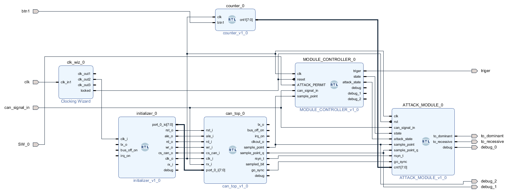
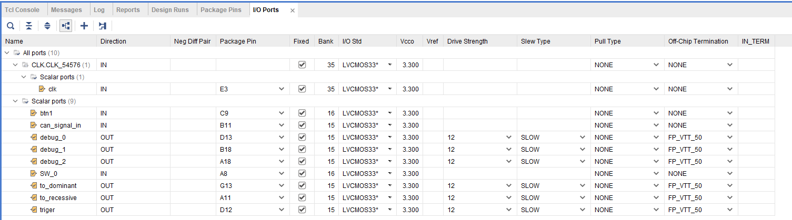
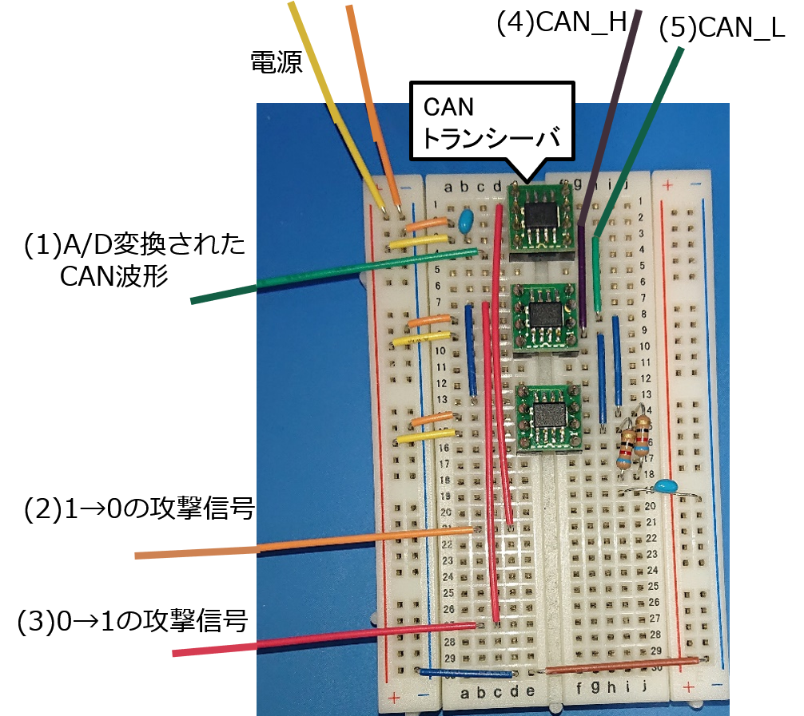

# 電気的データ改ざん自動化プログラム

電気的データ改ざん自動化の攻撃ツールのArty内のプログラム。

## 説明

攻撃ツール内にCANコントローラを実装し、それから情報を抽出しながら攻撃を行う。プログラムにパラメータとして、改ざん対象メッセージ及び改ざん先のメッセージを（スタッフビットも含めた）ビット列を渡し、バス上のECUと同じビットタイミングの設定を行うことで、自動的に攻撃信号出力位置を計算し改ざんを行ってくれる。  
ただし、そのままではあまり攻撃が成功しない。手動で電位差操作幅を調節可能なようにしてあり、調節することで攻撃できることもある。できないこともある。

## モジュールの説明



-   clk_wiz  
    クロック生成モジュール
-   can_top<br>
    githubから持ってきたCANコントローラのプログラム。（[CAN Protocol Controller][src]）sample pointのちょっと前にsample_point_qが1になる。以下のコードで2Tq前に1になるようにしている。最後の数字を2から3に変えれば3Tq前に1になる。<br>
    ```verilog:can_top.v
    assign       sample_point_q = (i_can_btl.clk_en_q & i_can_btl.seg1 & (i_can_btl.quant_cnt == (time_segment1 + i_can_btl.delay - 2)));
    ```
  -   can_registers  
       can_registerがいっぱい入っているビットタイミングの設定などを保存している。
  -   can_btl  
       Bit Time Logicモジュール。このモジュールが再同期などの処理を行っている。攻撃に必要な情報はここから取り出している。
  -   can_bsp  
       あんまり読んでないので分からないが、おそらくマイコンから送られてきた送信メッセージをストックしたり、受信メッセージをマイコンに渡したりしている。
-   initializer  
     can_topを動作させるには初めにビットタイミングの設定などの初期設定を行う必要があるため、それを行うためのモジュール。[CAN Protocol Controller][src]に付属していたシミュレーション用プログラムの初期化信号を見てまねた。現在の設定：SJW:2Tq, TSEG1:9Tq, TSEG2:6Tq
-   MODULE_CONTROLLER<br>
    攻撃対象メッセージの判定などを行っているモジュール群。
    -   BUS_MSG_OBSERVER  
        バスの波形を一定時間ごとにサンプリングしてビットの値を配列に格納するモジュール。
    -   STATE_DETECTOR  
        バス上の状態を判別するモジュール。メッセージフレームが流れているかどうか。
    -   MSG_FILTER  
        攻撃対象メッセージの判定を行ない、トリガを出力。また、攻撃スイッチがONであれば攻撃用のトリガーも出力する。このトリガが立っていれば、攻撃回路が回る。
-   ATTACK_MODULE  
    攻撃信号を出力するモジュール。攻撃する必要のあるビットで、sample_point_qが1になったら攻撃信号を出力。一定カウントで出力停止。
-   counter  
    攻撃信号幅を手動で調節するためのモジュール。ボタンを押すごとにカウンターを+２する。18になったら10に戻す。

[src]: https://github.com/freecores/can

## I/O Portの説明

プロジェクトをコピーするとこの設定がよくバグるので注意。その場合は以下の画像のように設定しなおす。


-   入力信号
    -   btn1  
          Arty上のbtn1の入力
    -   clk  
          クロック入力100MHz
    -   can_signal_in  
          CANトランシーバでA/D変換された信号を入力
    -   SW_0  
          Arty上のSW0の入力
-   出力信号
    -   triger  
          オシロようのトリガ。攻撃対象メッセージが来たら出力。
    -   to_dominant  
          1→0の攻撃信号。何もしない時はリセッシブ、電位差操作時はドミナント。
    -   to_recessive  
          0→1の攻撃信号。
    -   debug_0, debug_1, degbug_2  
        デバッグ用のポート

## 使用方法

1.  環境を整える  
   まず、攻撃対象のネットワークを構成する必要がある。修論の実験ではCANoeを用いてネットワークを構成している。VN1630AにはCANのポートが2つあり、一方を送信側、他方を受信側としている。ハブなどを使用しそのCANバスに攻撃ツールを接続する。実験時のCANoe設定ファイルはCANoeConfigフォルダに入れてある。

2.  プログラムのパラメータ設定  
      initializer.v:  
      ビットタイミングの設定を記述しておく。

      ```verilog:initializer.v
      /* Bit Timing 0 register value */
      `define CAN_TIMING0_BRP                 6'h0    /* Baud rate prescaler (2*(value+1)) */
      `define CAN_TIMING0_SJW                 2'h1    /* SJW (value+1) */
      /* Bit Timing 1 register value */
      `define CAN_TIMING1_TSEG1               4'h8    /* TSEG1 segment (value+1) */
      `define CAN_TIMING1_TSEG2               3'h5    /* TSEG2 segment (value+1) */
      ```

      MSG_FILTER.v :  
      TARGETに攻撃対象メッセージのIDを指定する。ID内にスタッフビットが入る場合にはそれも含める。

      ```verilog:MSG_FILTER.v
      parameter TARGET = {96'b1,1'b0,11'h19a}; //id:0x19A
      ```

      ATTACK_MODULE.v :  
      UNATTACKED_MSGに攻撃対象メッセージのビット列、ATTACKED_MSGに改ざん後のビット列を格納する。
      MSG_Lはメッセージの長さ。異なる長さのメッセージ同士の改ざんには非対応。

      ```verilog:ATTACK_MODULE.v
      parameter UNATTACKED_MSG =  44'b00011001101000001001000001000010010011001111;   //ID:19A,DATA:0のメッセージ
      parameter ATTACKED_MSG =    44'b00011001101000001001000001001110000101010110;  //ID:19A,DATA:1のメッセージ
      parameter MSG_L = 8'd44;
      ```

3. generate bitstream  
   vivadoでビットストリームを生成し、Artyに書き込む。
4.  スイッチON  
   Arty上のSW0を切り替えると攻撃が始まる。
5.  電位差操作幅調節  
   Arty上のBTN1を押すことで電位差操作幅を調節できる。デフォルトは10\*62.5ns=625ns。一回押すごとにカウンタが2増える。カウンタは18まで増え、次にボタンを押すと10に戻る。つまり、10\*62.5ns~18\*62.5nsの範囲で2\*62.5ns毎に調節できる。
6.  その他  
   4の調節で攻撃がうまくいかなかった場合、sample_point_qの条件を調節することで攻撃信号出力開始位置をずらしてみることもできる。

## 攻撃回路
Arty周りの回路についての説明。(1)(2)(3)はArtyの対象のポートにつなぐ。(4)(5)は攻撃対象のCANバスに接続する。

<div style="text-align:center;">

</div>
